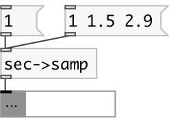

[index](index.html) :: [conv](category_conv.html)
---

# conv.sec2samp

###### convert time in seconds to number of samples according to current samplerate

*доступно с версии:* 0.2

---

## входы:

* time in seconds 
_тип:_ control

## выходы:

* converted value (float or list) 
_тип:_ control

## ключевые слова:

[conv](keywords/conv.html)
[samp](keywords/samp.html)
[sec](keywords/sec.html)

**Смотрите также:**
[\[conv.samp2sec\]](conv.samp2sec.html)

**Авторы:** Serge Poltavsky

**Лицензия:** GPL3 or later

