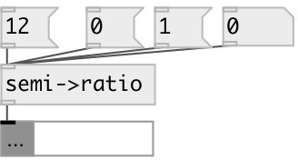

[index](index.html) :: [conv](category_conv.html)
---

# conv.semi2ratio

###### convert interval in semitones to frequency ratio in 12-ET

*доступно с версии:* 0.9.7

---

## входы:

* interval in semitones 
_тип:_ control

## выходы:

* float or list: frequency ratio(s) 
_тип:_ control

## ключевые слова:

[conv](keywords/conv.html)
[samp](keywords/samp.html)

**Авторы:** Serge Poltavsky

**Лицензия:** GPL3 or later

