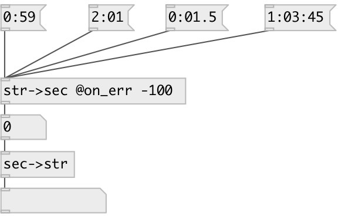

[index](index.html) :: [conv](category_conv.html)
---

# conv.str2sec

###### converts formatted time to float value in seconds

*доступно с версии:* 0.1

---

## свойства:

* **@on_err** 
Запросить/установить value returned when unrecognized symbol given 
_тип:_ float 
_по умолчанию:_ -1 

## входы:

* Time in format: &#34;HH:MM::SS[.XXX]&#34; 
_тип:_ control

## выходы:

* time in seconds 
_тип:_ control

## ключевые слова:

[conv](keywords/conv.html)
[time](keywords/time.html)

**Смотрите также:**
[\[conv.sec2str\]](conv.sec2str.html)

**Авторы:** Serge Poltavsky

**Лицензия:** GPL3 or later

