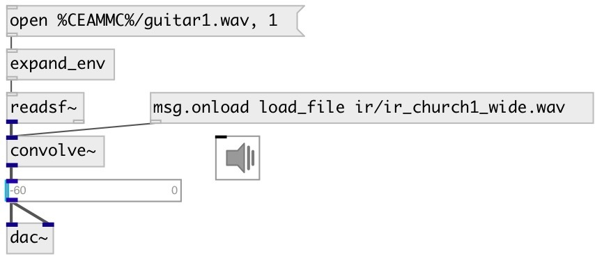

[index](index.html) :: [base](category_base.html)
---

# convolve~

###### realtime FFT convolution

*доступно с версии:* 0.9.7

---

## методы:

* **load_file**
load IR from specified file (resamples if required from file samplerate to
runtime samplerate) 
  __параметры:__
  - **FILE** file name, relative or absolute 
    тип: atom  
    обязательно: True  

* **load_array**
load IR from array 
  __параметры:__
  - **ARRAY** array name 
    тип: symbol  
    обязательно: True  

* **set**
set IR from list 
  __параметры:__
  - **LIST** IR data 
    тип: float  
    обязательно: True  

## свойства:

* **@offset** 
Запросить/установить impulse response (IR) offset 
_тип:_ int 
_единица:_ samp 
_минимальное значение:_ 0 
_по умолчанию:_ 0 

* **@maxsize** 
Запросить/установить max impulse response size 
_тип:_ int 
_единица:_ samp 
_диапазон:_ 0..300000 
_по умолчанию:_ 50000 

* **@norm** 
Запросить/установить normalize impulse response 
_тип:_ bool 
_по умолчанию:_ 1 

## входы:

* input signal 
_тип:_ audio

## выходы:

* output signal 
_тип:_ audio

## ключевые слова:

[fft](keywords/fft.html)
[convolution](keywords/convolution.html)
[IR](keywords/IR.html)
[impulse](keywords/impulse.html)
[response](keywords/response.html)

**Авторы:** Serge Poltavsky

**Лицензия:** GPL3 or later

