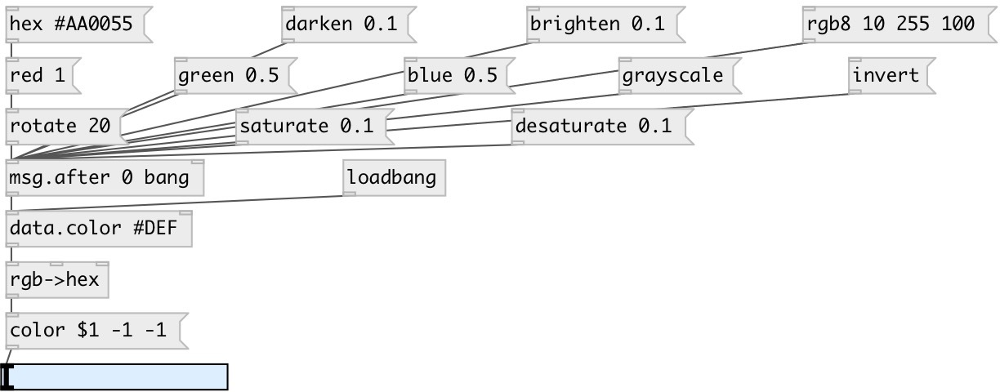

[index](index.html) :: [data](category_data.html)
---

# data.color

###### Color datatype

*доступно с версии:* 0.9.7

---

## аргументы:

* **VALUE**
initial value 
_тип:_ atom 

## методы:

* **alpha**
set alpha channel value 
  __параметры:__
  - **ALPHA** value 
    тип: float  
    обязательно: True  

* **alpha**
set alpha channel 
  __параметры:__
  - **ALPHA** alpha value 
    тип: float  
    обязательно: True  

* **blue**
set blue channel value 
  __параметры:__
  - **BLUE** value 
    тип: float  
    обязательно: True  

* **blue**
set blue channel 
  __параметры:__
  - **BLUE** blue value 
    тип: float  
    обязательно: True  

* **brighten**
set color brighter 
  __параметры:__
  - **V** value 
    тип: float  
    обязательно: True  

* **darken**
set color darker 
  __параметры:__
  - **V** value 
    тип: float  
    обязательно: True  

* **desaturate**
decrease color saturation 
  __параметры:__
  - **V** value 
    тип: float  
    обязательно: True  

* **flip**
flip color hue 
  __параметры:__
  - **[V]** v 
    тип: float  

* **grayscale**
convert color to grayscale 

* **green**
set green channel value 
  __параметры:__
  - **GREEN** value 
    тип: float  
    обязательно: True  

* **green**
set green channel 
  __параметры:__
  - **GREEN** green value 
    тип: float  
    обязательно: True  

* **hex**
set color with hex #RGB or #RRGGBB value 
  __параметры:__
  - **HEX** mix amount 
    тип: symbol  
    обязательно: True  

* **hsl**
set color in HSL colorspace 
  __параметры:__
  - **HUE** hue value 
    тип: float  
    обязательно: True  

  - **SATURATION** saturation value 
    тип: float  
    обязательно: True  

  - **LIGHTNESS** lightness value 
    тип: float  
    обязательно: True  

  - **[ALPHA]** alpha value 
    тип: float  

* **hwb**
set color in HWB colorspace 
  __параметры:__
  - **HUE** hue value 
    тип: float  
    обязательно: True  

  - **WHITENESS** whiteness value 
    тип: float  
    обязательно: True  

  - **BLACKNESS** blackness value 
    тип: float  
    обязательно: True  

  - **[ALPHA]** alpha value 
    тип: float  

* **invert**
invert color in RGB colorspace 

* **mix**
mix with specified color 
  __параметры:__
  - **COLOR** color to mix with 
    тип: data:color  
    обязательно: True  

  - **MIX** mix amount 
    тип: float  
    обязательно: True  

* **oklab**
set color in OkLab colorspace 
  __параметры:__
  - **HUE** hue value 
    тип: float  
    обязательно: True  

  - **a** a value 
    тип: float  
    обязательно: True  

  - **b** b value 
    тип: float  
    обязательно: True  

  - **[ALPHA]** alpha value 
    тип: float  

* **red**
set red channel value 
  __параметры:__
  - **RED** value 
    тип: float  
    обязательно: True  

* **red**
set red channel 
  __параметры:__
  - **RED** red value 
    тип: float  
    обязательно: True  

* **rgb**
set RGB with floats 
  __параметры:__
  - **RED** red value 
    тип: float  
    обязательно: True  

  - **GREEN** green value 
    тип: float  
    обязательно: True  

  - **BLUE** blue value 
    тип: float  
    обязательно: True  

  - **[ALPHA]** alpha value 
    тип: float  

* **rgb8**
set RGB with int values 
  __параметры:__
  - **RED** red value 
    тип: int  
    обязательно: True  

  - **GREEN** green value 
    тип: int  
    обязательно: True  

  - **BLUE** blue value 
    тип: int  
    обязательно: True  

  - **[ALPHA]** alpha value 
    тип: int  

* **rotate**
rotate color hue 
  __параметры:__
  - **V** rotation angle 
    тип: float  
    обязательно: True  

* **saturate**
increase color saturation 
  __параметры:__
  - **V** value 
    тип: float  
    обязательно: True  

* **set**
set color 
  __параметры:__
  - **COLOR** new color value 
    тип: data:color  
    обязательно: True  

## свойства:

* **@value** 
Запросить/установить current color 
_тип:_ atom 

## входы:

* set color and output 
_тип:_ control
* set color without output 
_тип:_ control

## выходы:

* data:color output 
_тип:_ control

## ключевые слова:

[data](keywords/data.html)
[color](keywords/color.html)

**Авторы:** Serge Poltavsky

**Лицензия:** GPL3 or later

