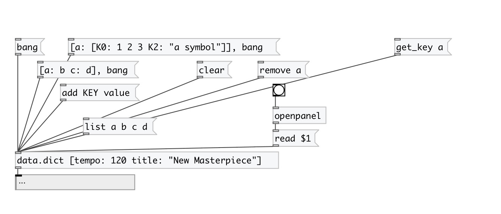

[< справка — содержание](index.html)
---

# data.dict

Контейнер для словаря (dictionary): хранит пары ключ-значение

---

Синтаксис: [ключ1: значение ключ2 : &#34;текст с пробелами&#34;]. Поддерживаются вложенные словари: [a:
            [A:1 B:2]]).
 

---

---
аргументы:

---
свойства:

@keys: ключи словаря 
@empty: 1 если словарь пустой, в остальных случаях - 0 
@size: количество сохраненных элементов в словаре 

---
смотрите также: 

