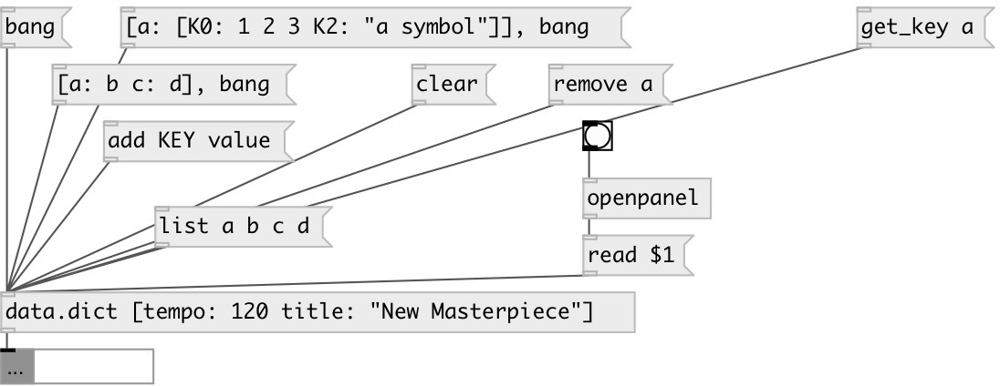

[index](index.html) :: [data](category_data.html)
---

# data.dict

###### dictionary container: store values by key

*доступно с версии:* 0.6

---

## информация
Syntax: [key1: value key2 : &#34;with space&#34;]. Nested dictionaries are supported: [a: [A:1 B:2]]).

## методы:

* **[....]**
sets new content without output 

* **add**
adds entry to dictionary 
  __параметры:__
  - **KEY** entry key 
    тип: symbol  
    обязательно: True  

  - **VAL** single value or list 
    тип: list  
    обязательно: True  

* **choose**
choose random key and output it 

* **clear**
removes all dict values. No output 

* **get_key**
get entry from dictionary 
  __параметры:__
  - **KEY** entry key 
    тип: symbol  
    обязательно: True  

* **read**
read dict from JSON file 
  __параметры:__
  - **PATH** file path 
    тип: symbol  
    обязательно: True  

* **remove**
remove entry from dictionary 
  __параметры:__
  - **KEY** entry key 
    тип: symbol  
    обязательно: True  

* **set**
set dict content without output 

* **set_key**
change entry in dictionary. If it&#39;s not exists, do nothing. 
  __параметры:__
  - **KEY** key 
    тип: symbol  
    обязательно: True  

  - **VAL** single value or list 
    тип: list  
    обязательно: True  

* **write**
write dict as JSON file 
  __параметры:__
  - **PATH** file path 
    тип: symbol  
    обязательно: True  

## свойства:

* **@keys** (readonly)
Запросить keys of dictionary 
_тип:_ list 

* **@empty** (readonly)
Запросить 1 if dict is empty, otherwise 0 
_тип:_ bool 
_по умолчанию:_ 1 

* **@size** (readonly)
Запросить number of entries in dictionary 
_тип:_ int 
_минимальное значение:_ 0 
_по умолчанию:_ 0 

## входы:

* output current dictionary value 
_тип:_ control

## выходы:

* output dictionary 
_тип:_ control

## ключевые слова:

[data](keywords/data.html)
[dictionary](keywords/dictionary.html)

**Смотрите также:**
[\[data.set\]](data.set.html)
[\[data.mlist\]](data.mlist.html)

**Авторы:** Serge Poltavsky

**Лицензия:** GPL3 or later

