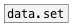
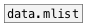

[< справка — содержание](index.html)
---

# data.dict


Контейнер для словаря (dictionary): хранит пары ключ-значение

---

Синтаксис: [ключ1: значение ключ2 : &#34;текст с пробелами&#34;]. Поддерживаются вложенные словари: [a:
            [A:1 B:2]]).
<br>


---


```


[bang( [[a: [K0: 1 2 3 K2: "a symbol"]], bang #a( [get_key a #b(
|
|  [[a: b c: d], bang(  [clear( [remove a(
|  |                    |       |
|  |  [add KEY value(   |       | [B]
|  |  |                 |       | |
|  |  |                 |       | [openpanel]
|  |  |  [list a b c d( |       | |
|  |  |  |              |       | [read $1(
|  |  |  |              |       | |
[data.dict \[tempo: 120 title: "New Masterpiece"\] #z]
|
[ui.display @display_type=1]
[X a->z] [X b->z]

            
```

---
аргументы:


---
свойства:

@keys: ключи словаря<br>
@empty: 1 если словарь пустой, в остальных случаях - 0<br>
@size: количество сохраненных элементов в словаре<br>

---
смотрите также:<br>
[](data.set.html)
[](data.mlist.html)
