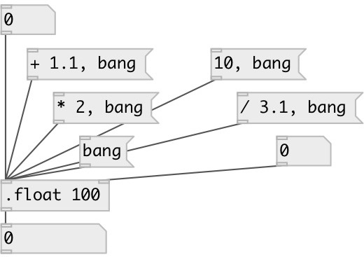

[index](index.html) :: [data](category_data.html)
---

# data.float

###### robust float object

*доступно с версии:* 0.6

---

## аргументы:

* **VALUE**
set initial value 
_тип:_ float 

## методы:

* **set**
sets new value without output 

* **+**
add to float, no output 

* **-**
subtract from float, no output 

* *****
multiply to, no output 

* **/**
divide by, no output 

## свойства:

* **@value** (readonly)
Запросить current value 
_тип:_ float 
_по умолчанию:_ 0 

## входы:

* output value 
_тип:_ control
* set new value without output 
_тип:_ control

## выходы:

* set output 
_тип:_ control

## ключевые слова:

[data](keywords/data.html)
[float](keywords/float.html)

**Смотрите также:**
[\[data.int\]](data.int.html)

**Авторы:** Serge Poltavsky

**Лицензия:** GPL3 or later

