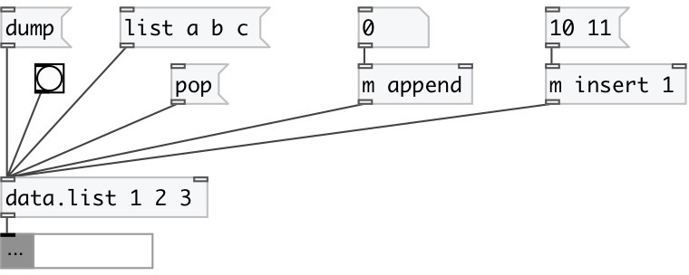

[index](index.html) :: [data](category_data.html)
---

# data.list

###### list container

*доступно с версии:* 0.1

---

## аргументы:

* **VALUE**
initial list values 
_тип:_ list 

## методы:

* **append**
adds values to the end of the list 
  __параметры:__
  - **VAL** appended value 
    тип: atom  
    обязательно: True  

* **at**
outputs atom at the specified position 
  __параметры:__
  - **IDX** position (negative indexes are supported: -1 means last element) 
    тип: int  
    обязательно: True  

* **back**
output last list element 

* **choose**
choose random element in list and output it 

* **clear**
removes all list elements 

* **dump**
dump object info to Pd window 

* **fill**
fills with specified value 
  __параметры:__
  - **VAL** fill value 
    тип: atom  
    обязательно: True  

* **front**
output first list element 

* **insert**
inserts values to the specified position 
  __параметры:__
  - **IDX** insert position 
    тип: int  
    обязательно: True  

  - **VAL** value 
    тип: atom  
    обязательно: True  

* **pop**
removes last list element 

* **prepend**
inserts values to the list beginning 
  __параметры:__
  - **VAL** prepended value 
    тип: atom  
    обязательно: True  

* **remove**
removes specified element 
  __параметры:__
  - **IDX** element index 
    тип: int  
    обязательно: True  

* **reverse**
reverses list 

* **set**
sets new list without output 
  __параметры:__
  - **LIST** new list content 
    тип: list  
    обязательно: True  

* **shuffle**
put elements in random order 

* **sort**
sorts list 

## свойства:

* **@empty** (readonly)
Запросить 1 if list is empty, otherwise 0 
_тип:_ bool 
_по умолчанию:_ 1 

* **@size** (readonly)
Запросить number of elements in list 
_тип:_ int 
_минимальное значение:_ 0 
_по умолчанию:_ 0 

* **@value** 
Запросить/установить current value 
_тип:_ list 

## входы:

* output list content 
_тип:_ control
* sets new list without output 
_тип:_ control

## выходы:

* output list or list elements 
_тип:_ control

## ключевые слова:

[data](keywords/data.html)
[list](keywords/list.html)

**Смотрите также:**
[\[data.fifo\]](data.fifo.html)

**Авторы:** Serge Poltavsky

**Лицензия:** GPL3 or later

