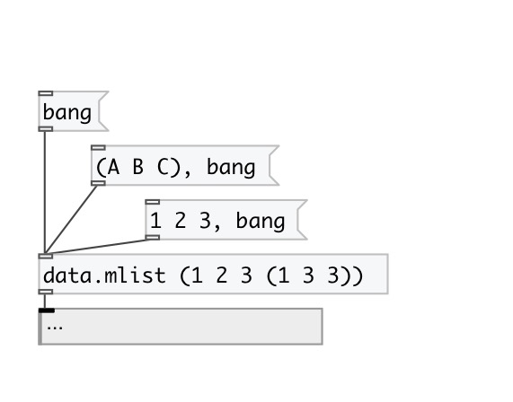

[< справка — содержание](index.html)
---

# data.mlist

Контейнер для многоуровневого списка (mlist)

---

Синтаксис: значения, разделенные пробелами:(1 2 3) - список из значений 1, 2 и 3
Вложенные списки: (1 2 3 (значения элементов вложенного списка))
Символы с пробелами: (&#34;список с одним элементом&#34;)
 

---

---
аргументы:

X: начальные значения для списка. Пример: (1 2 3 (1 2)
            4) 

---
свойства:

@empty: 1 если список пустой, иначе 0 
@size: количество элементов в списке 

---
смотрите также: 

