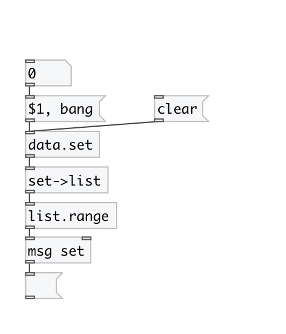
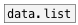

[< справка — содержание](index.html)
---

# data.set

Контейнер данных, который сохраняет только уникальные значения (set) - множество

---

 

---

---
аргументы:

X: элементы множества 

---
свойства:

@empty: 1 если множество пустое, иначе 0 
@size: количество элементов в множестве 

---
смотрите также: 

