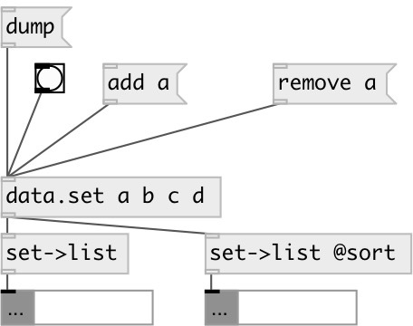

[index](index.html) :: [data](category_data.html)
---

# data.set2list

###### converts set to list

*доступно с версии:* 0.3

---

## информация
Note: output list is not sorted by default. You can use @sort flag to get sorted output

## свойства:

* **@sort** 
Получить/установить if specified - sort output list 
_тип:_ flag 
_по умолчанию:_ 0 

## входы:

* input set 
_тип:_ control

## выходы:

* output list 
_тип:_ control

## ключевые слова:

[data](keywords/data.html)
[set](keywords/set.html)
[list](keywords/list.html)

**Смотрите также:**
[\[data.set\]](data.set.html)

**Авторы:** Serge Poltavsky

**Лицензия:** GPL3 or later

