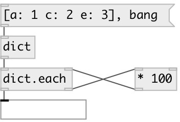

[index](index.html) :: [data](category_data.html)
---

# dict.each

###### map each value in dict

*доступно с версии:* 0.7

---

## входы:

* input dictionary 
_тип:_ control
* new key value from sidechain 
_тип:_ control

## выходы:

* processed dict 
_тип:_ control
* send value to sidechain 
_тип:_ control

## ключевые слова:

[each](keywords/each.html)
[iterate](keywords/iterate.html)
[dictionary](keywords/dictionary.html)

**Смотрите также:**
[\[data.dict\]](data.dict.html)

**Авторы:** Serge Poltavsky

**Лицензия:** GPL3 or later

