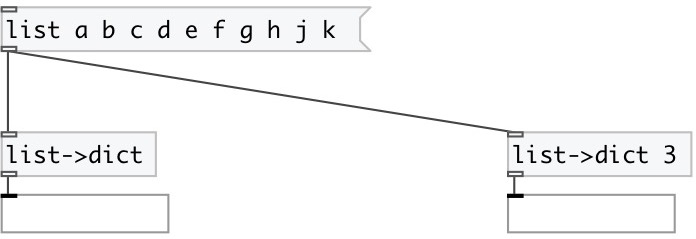

[index](index.html) :: [data](category_data.html)
---

# dict.from_list

###### creates dictionary from list

*доступно с версии:* 0.7

---

## информация
Convertion depends on property @step, which means a length of key/value pair. First element of the pair becames a key, and other elements becames value.

## аргументы:

* **STEP**
key/value length in input list 
_тип:_ int 

## свойства:

* **@step** 
Запросить/установить key/value length in input list 
_тип:_ int 
_минимальное значение:_ 2 
_по умолчанию:_ 2 

## входы:

* input 
_тип:_ control

## выходы:

* dict output 
_тип:_ control

## ключевые слова:

[dictionary](keywords/dictionary.html)

**Смотрите также:**
[\[data.dict\]](data.dict.html)

**Авторы:** Serge Poltavsky

**Лицензия:** GPL3 or later

