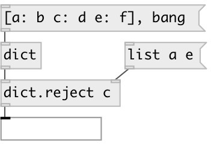

[index](index.html) :: [data](category_data.html)
---

# dict.reject

###### rejects specified keys from dict

*доступно с версии:* 0.7

---

## аргументы:

* **KEYS**
keys 
_тип:_ list 

## свойства:

* **@keys** 
Получить/установить rejected keys 
_тип:_ list 

## входы:

* input dictionary 
_тип:_ control
* set rejected keys 
_тип:_ control

## выходы:

* new dict with filtered keys 
_тип:_ control

## ключевые слова:

[reject](keywords/reject.html)
[dictionary](keywords/dictionary.html)

**Смотрите также:**
[\[data.dict\]](data.dict.html)

**Авторы:** Serge Poltavsky

**Лицензия:** GPL3 or later

