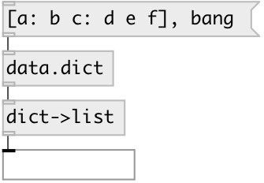

[index](index.html) :: [data](category_data.html)
---

# dict.to_list

###### converts dictionary to plain list

*доступно с версии:* 0.7

---

## свойства:

* **@props** (initonly)
Запросить/установить output as list of properties: @key1 vals.. @key2 vals2... 
_тип:_ flag 

## входы:

* input 
_тип:_ control

## выходы:

* list output 
_тип:_ control

## ключевые слова:

[dictionary](keywords/dictionary.html)

**Смотрите также:**
[\[data.dict\]](data.dict.html)

**Авторы:** Serge Poltavsky

**Лицензия:** GPL3 or later

