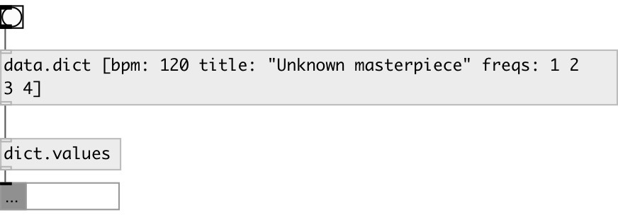

[index](index.html) :: [data](category_data.html)
---

# dict.values

###### dictionary values as mlist

*доступно с версии:* 0.6

---

## входы:

* data.dict 
_тип:_ control

## выходы:

* mlist of values 
_тип:_ control

## ключевые слова:

[size](keywords/size.html)
[dictionary](keywords/dictionary.html)

**Смотрите также:**
[\[data.dict\]](data.dict.html)
[\[data.mlist\]](data.mlist.html)
[\[dict.keys\]](dict.keys.html)

**Авторы:** Serge Poltavsky

**Лицензия:** GPL3 or later

