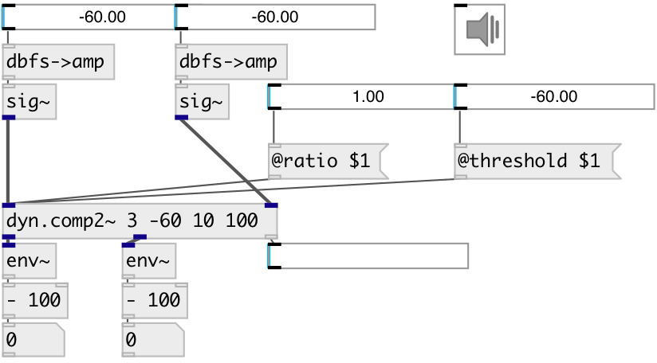

[index](index.html) :: [dyn](category_dyn.html)
---

# dyn.comp2~

###### stereo dynamic range compressor

*доступно с версии:* 0.1

---

## аргументы:

* **RATIO**
compression ratio (1 = no compression, &gt;1 means compression) 
_тип:_ float 

* **THRESHOLD**
level threshold above which compression kicks in (100 dB = max level) 
_тип:_ float 
_единица:_ db 

* **ATTACK**
attack time = time constant when level &amp; compression going up 
_тип:_ float 
_единица:_ ms 

* **RELEASE**
release time = time constant coming out of compression 
_тип:_ float 
_единица:_ ms 

## свойства:

* **@ratio** 
Запросить/установить compression ratio (1 = no compression, &gt;1 means compression) 
_тип:_ float 
_диапазон:_ 1..10 
_по умолчанию:_ 1 

* **@threshold** 
Запросить/установить level threshold above which compression kicks in (100 dB = max level) 
_тип:_ float 
_единица:_ db 
_диапазон:_ 0..100 
_по умолчанию:_ 100 

* **@attack** 
Запросить/установить time constant when level &amp; compression going up 
_тип:_ float 
_единица:_ ms 
_диапазон:_ 1..100 
_по умолчанию:_ 10 

* **@release** 
Запросить/установить release time = time constant coming out of compression 
_тип:_ float 
_единица:_ ms 
_диапазон:_ 1..500 
_по умолчанию:_ 50 

* **@gain** 
Запросить/установить make up gain: applied to the signal after the compression takes place 
_тип:_ float 
_единица:_ db 
_диапазон:_ -12..12 
_по умолчанию:_ 0 

* **@active** 
Запросить/установить on/off dsp processing 
_тип:_ bool 
_по умолчанию:_ 1 

## входы:

* left input signal 
_тип:_ audio
* right input signal 
_тип:_ audio

## выходы:

* left output signal 
_тип:_ audio
* right output signal 
_тип:_ audio

## ключевые слова:

[compressor](keywords/compressor.html)

**Смотрите также:**
[\[dyn.comp~\]](dyn.comp~.html)

**Авторы:** Alex Nadzharov, Serge Poltavsky

**Лицензия:** GPL3 or later

