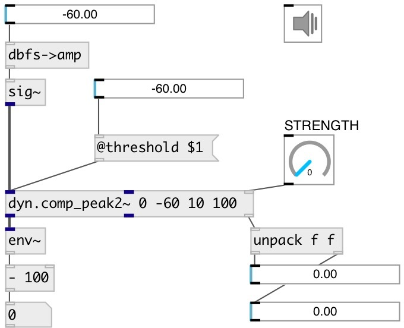

[index](index.html) :: [dyn](category_dyn.html)
---

# dyn.comp_peak2~

###### stereo peak feed forward compressor with channel linking

*доступно с версии:* 0.9.7

---

## информация
It uses a strength parameter instead of the traditional ratio, in order to be able to function as a hard limiter or overcompressor

## аргументы:

* **STRENGTH**
strength of the compression (0 = no compression, 1 means hard limiting, &gt;1
means over-compression) 
_тип:_ float 

* **THRESHOLD**
level threshold above which compression kicks in 
_тип:_ float 
_единица:_ db 

* **ATTACK**
attack time = time constant when level &amp; compression going up 
_тип:_ float 
_единица:_ ms 

* **RELEASE**
release time = time constant coming out of compression 
_тип:_ float 
_единица:_ ms 

## методы:

* **reset**
reset to initial state 

## свойства:

* **@strength** 
Запросить/установить strength of the compression (0 = no compression, 1 means hard limiting, &gt;1
means over-compression) 
_тип:_ float 
_диапазон:_ 0..2 
_по умолчанию:_ 0 

* **@threshold** 
Запросить/установить level threshold above which compression kicks in (100 dB = max level) 
_тип:_ float 
_единица:_ db 
_диапазон:_ -60..0 
_по умолчанию:_ -10 

* **@attack** 
Запросить/установить time constant when level &amp; compression going up 
_тип:_ float 
_единица:_ ms 
_диапазон:_ 0.1..100 
_по умолчанию:_ 10 

* **@release** 
Запросить/установить release time = time constant coming out of compression 
_тип:_ float 
_единица:_ ms 
_диапазон:_ 1..500 
_по умолчанию:_ 50 

* **@gain** 
Запросить/установить make up gain: applied to the signal after the compression takes place 
_тип:_ float 
_единица:_ db 
_диапазон:_ -18..18 
_по умолчанию:_ 0 

* **@knee** 
Запросить/установить a gradual increase in gain reduction around the threshold: below
thresh-(knee/2) there is no gain reduction, above thresh+(knee/2) there is the
same gain reduction as without a knee, and in between there is a gradual
increase in gain reduction 
_тип:_ float 
_единица:_ db 
_диапазон:_ 0..6 
_по умолчанию:_ 3 

* **@bypass** 
Запросить/установить bypass flag. If true: bypass &#39;effected&#39; signal. 
_тип:_ bool 
_по умолчанию:_ 0 

* **@link** 
Запросить/установить the amount of linkage between the channels: 0 = each channel is independent, 1
= all channels have the same amount of gain reduction 
_тип:_ float 
_диапазон:_ 0..1 
_по умолчанию:_ 1 

* **@level0** (readonly)
Запросить current level of compression of first channel 
_тип:_ float 
_диапазон:_ 0..1 
_по умолчанию:_ 0 

* **@level1** (readonly)
Запросить current level of compression of second channel 
_тип:_ float 
_диапазон:_ 0..1 
_по умолчанию:_ 0 

* **@refresh** 
Запросить/установить compression level output time interval. If 0 - no output 
_тип:_ int 
_единица:_ ms 
_диапазон:_ 0..1000 
_по умолчанию:_ 100 

* **@active** 
Запросить/установить on/off dsp processing 
_тип:_ bool 
_по умолчанию:_ 1 

* **@osc** (initonly)
Запросить/установить OSC server name to listen 
_тип:_ symbol 

* **@id** (initonly)
Запросить/установить OSC address id. If specified, bind all properties to
/ID/dyn_comp_peak2/PROP_NAME osc address, if empty bind to
/dyn_comp_peak2/PROP_NAME. 
_тип:_ symbol 

## входы:

* left input signal 
_тип:_ audio
* right input signal 
_тип:_ audio
* set compression strength 
_тип:_ control

## выходы:

* left compressed signal 
_тип:_ audio
* right compressed signal 
_тип:_ audio
* list: output current compression level in [0..1] 
_тип:_ control

## ключевые слова:

[compressor](keywords/compressor.html)

**Смотрите также:**
[\[dyn.comp_peak~\]](dyn.comp_peak~.html)

**Авторы:** Serge Poltavsky

**Лицензия:** GPL3 or later

