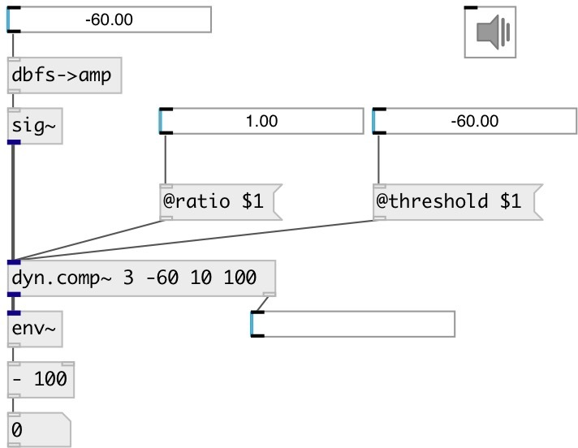

[index](index.html) :: [dyn](category_dyn.html)
---

# dyn.comp~

###### mono dynamic range compressors

*доступно с версии:* 0.1

---

## аргументы:

* **ratio**
compression ratio (1 = no compression, &gt;1 means compression) 
_тип:_ float 

* **threshold**
level threshold above which compression kicks in (100 dB = max level) 
_тип:_ float 
_единица:_ db 

* **attack**
attack time = time constant when level &amp; compression going up 
_тип:_ float 
_единица:_ ms 

* **release**
release time = time constant coming out of compression 
_тип:_ float 
_единица:_ ms 

* **ID**
object ID for OSC control path 
_тип:_ symbol 

## свойства:

* **@ratio** 
Получить/установить compression ratio (1 = no compression, &gt;1 means compression) 
_тип:_ float 
_диапазон:_ 1..10 
_по умолчанию:_ 1 

* **@threshold** 
Получить/установить level threshold above which compression kicks in (100 dB = max level) 
_тип:_ float 
_единица:_ db 
_диапазон:_ 0..100 
_по умолчанию:_ 100 

* **@attack** 
Получить/установить time constant when level &amp; compression going up 
_тип:_ float 
_единица:_ ms 
_диапазон:_ 1..100 
_по умолчанию:_ 10 

* **@release** 
Получить/установить release time = time constant coming out of compression 
_тип:_ float 
_единица:_ ms 
_диапазон:_ 1..500 
_по умолчанию:_ 50 

* **@active** 
Получить/установить on/off dsp processing 
_тип:_ int 
_варианты:_ 0, 1 
_по умолчанию:_ 1 

## входы:

* input signal 
_тип:_ audio

## выходы:

* output signal 
_тип:_ audio
* information output 
_тип:_ control

## ключевые слова:

[compressor](keywords/compressor.html)

**Смотрите также:**
[\[dyn.comp2~\]](dyn.comp2~.html)

**Авторы:** Alex Nadzharov, Serge Poltavsky

**Лицензия:** GPL3 or later

