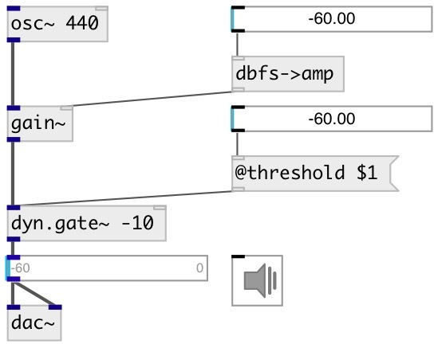

[index](index.html) :: [dyn](category_dyn.html)
---

# dyn.gate~

###### mono signal gate

*доступно с версии:* 0.1

---

## аргументы:

* **THRESHOLD**
dB level threshold above which gate opens 
_тип:_ float 
_единица:_ db 

* **ATTACK**
attack time = time constant (ms) for gate to open 
_тип:_ float 
_единица:_ ms 

* **HOLD**
hold time = time (ms) gate stays open after signal level &lt; threshold 
_тип:_ float 
_единица:_ ms 

* **RELEASE**
release time = time constant (ms) for gate to close 
_тип:_ float 
_единица:_ ms 

## методы:

* **reset**
reset to initial state 

## свойства:

* **@threshold** 
Запросить/установить dB level threshold above which gate opens 
_тип:_ float 
_единица:_ db 
_диапазон:_ -90..0 
_по умолчанию:_ -60 

* **@attack** 
Запросить/установить attack time = time constant (ms) for gate to open 
_тип:_ float 
_единица:_ ms 
_диапазон:_ 0..500 
_по умолчанию:_ 0.1 

* **@hold** 
Запросить/установить hold time = time (ms) gate stays open after signal level &lt; threshold 
_тип:_ float 
_единица:_ ms 
_диапазон:_ 1..500 
_по умолчанию:_ 100 

* **@release** 
Запросить/установить release time = time constant (ms) for gate to close 
_тип:_ float 
_единица:_ ms 
_диапазон:_ 1..500 
_по умолчанию:_ 20 

* **@bypass** 
Запросить/установить bypass flag. If true: bypass &#39;effected&#39; signal. 
_тип:_ bool 
_по умолчанию:_ 0 

* **@active** 
Запросить/установить on/off dsp processing 
_тип:_ bool 
_по умолчанию:_ 1 

* **@osc** (initonly)
Запросить/установить OSC server name to listen 
_тип:_ symbol 

* **@id** (initonly)
Запросить/установить OSC address id. If specified, bind all properties to /ID/dyn_gate/PROP_NAME osc
address, if empty bind to /dyn_gate/PROP_NAME. 
_тип:_ symbol 

## входы:

* input signal 
_тип:_ audio
* set threshold 
_тип:_ control

## выходы:

* output signal 
_тип:_ audio

## ключевые слова:

[gate](keywords/gate.html)

**Смотрите также:**
[\[dyn.gate2~\]](dyn.gate2~.html)

**Авторы:** Alex Nadzharov, Serge Poltavsky

**Лицензия:** GPL3 or later

