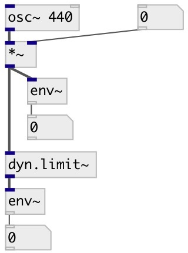

[index](index.html) :: [dyn](category_dyn.html)
---

# dyn.limit~

###### mono 1176LN Peak Limiter

*доступно с версии:* 0.1

---

## методы:

* **reset**
reset to initial state 

## свойства:

* **@active** 
Запросить/установить on/off dsp processing 
_тип:_ bool 
_по умолчанию:_ 1 

## входы:

* input signal 
_тип:_ audio

## выходы:

* output signal 
_тип:_ audio

## ключевые слова:

[limiter](keywords/limiter.html)

**Смотрите также:**
[\[dyn.limit2~\]](dyn.limit2~.html)
[\[dyn.comp~\]](dyn.comp~.html)

**Авторы:** Alex Nadzharov, Serge Poltavsky

**Лицензия:** GPL3 or later

