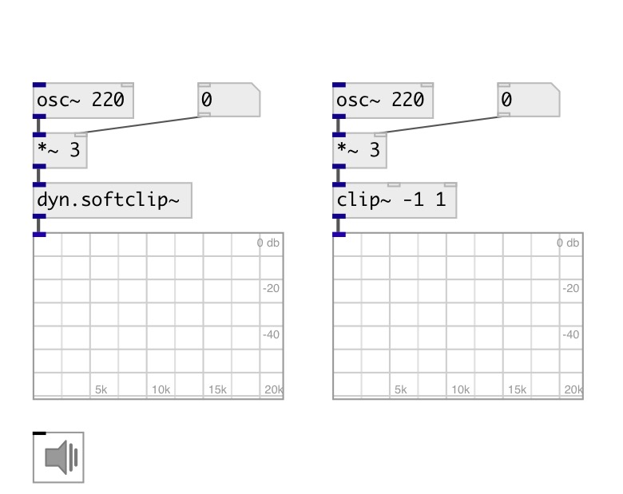

[index](index.html) :: [dyn](category_dyn.html)
---

# dyn.softclip~

###### soft signal clip

*доступно с версии:* 0.1

---

## свойства:

* **@active** 
Получить/установить on/off dsp processing 
_тип:_ int 
_варианты:_ 0, 1 
_по умолчанию:_ 1 

## входы:

* input signal 
_тип:_ audio

## выходы:

* output signal 
_тип:_ audio

## ключевые слова:

[dyn](keywords/dyn.html)
[clip](keywords/clip.html)
[limiter](keywords/limiter.html)

**Авторы:** Alex Nadzharov

**Лицензия:** GPL3 or later

