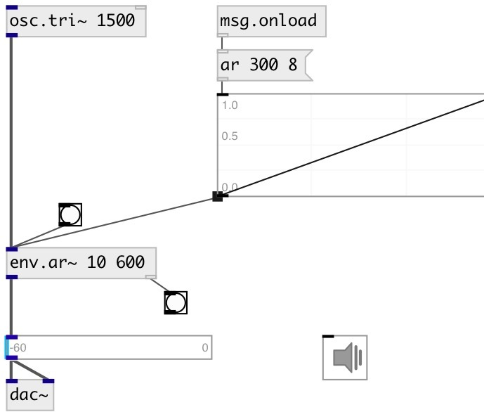

[index](index.html) :: [env](category_env.html)
---

# env.ar~

###### Attack/Release envelope generator

*доступно с версии:* 0.7

---

## информация
click on object to activate envelope

## аргументы:

* **attack**
attack time 
_тип:_ float 
_единица:_ ms 

* **release**
release time 
_тип:_ float 
_единица:_ ms 

## методы:

* **play**
run envelope 

* **reset**
reset envelope to initial state 

## свойства:

* **@attack** 
Получить/установить attack time 
_тип:_ float 
_единица:_ ms 
_диапазон:_ 0..100000 
_по умолчанию:_ 10 

* **@release** 
Получить/установить release time 
_тип:_ float 
_единица:_ ms 
_диапазон:_ 0..100000 
_по умолчанию:_ 300 

* **@gate** 
Получить/установить trigger signal 
_тип:_ int 
_варианты:_ 0, 1 
_по умолчанию:_ 0 

* **@ar** (readonly)
Получить attack release pair 
_тип:_ list 

* **@length** (readonly)
Получить envelope length 
_тип:_ float 
_единица:_ ms 
_по умолчанию:_ 310 

* **@active** 
Получить/установить on/off dsp processing 
_тип:_ int 
_варианты:_ 0, 1 
_по умолчанию:_ 1 

## входы:

* input signal 
_тип:_ audio

## выходы:

* output signal with applied envelope 
_тип:_ audio
* bang on done 
_тип:_ control

## ключевые слова:

[envelope](keywords/envelope.html)
[ar](keywords/ar.html)

**Смотрите также:**
[\[env.adsr~\]](env.adsr~.html)

**Авторы:** Serge Poltavsky

**Лицензия:** GPL3 or later

