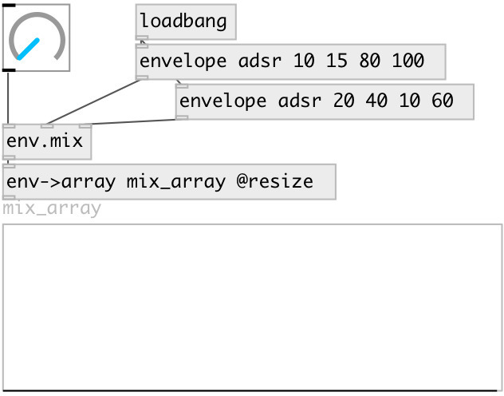

[index](index.html) :: [env](category_env.html)
---

# env.mix

###### Mix between two envelopes. Envelopes should contain equal number of segments

*доступно с версии:* 0.5

---

## входы:

* mix factor [0-1] 
_тип:_ control
* first envelope 
_тип:_ control
* second envelope 
_тип:_ control

## выходы:

* mixed envelope 
_тип:_ control

## ключевые слова:

[mix](keywords/mix.html)

**Смотрите также:**
[\[env.tscale\]](env.tscale.html)
[\[envelope\]](envelope.html)

**Авторы:** Serge Poltavsky

**Лицензия:** GPL3 or later

