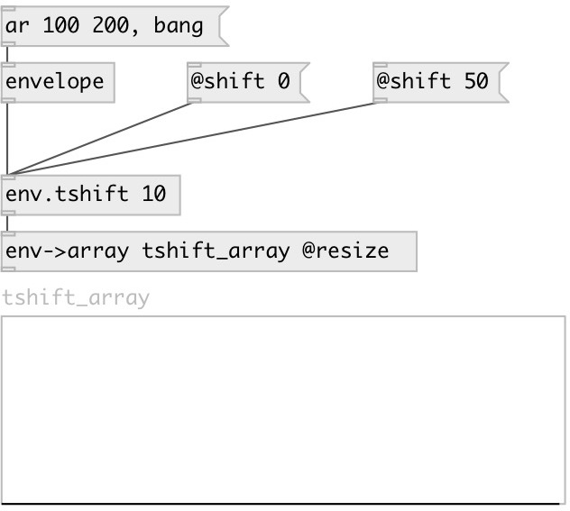

[index](index.html) :: [env](category_env.html)
---

# env.tshift

###### Envelope time-shift (horizontal)

*доступно с версии:* 0.5

---

## аргументы:

* **SHIFT**
time-shift 
_тип:_ float 
_единица:_ ms 

## свойства:

* **@shift** 
Получить/установить time-shift 
_тип:_ float 
_единица:_ ms 
_по умолчанию:_ 0 

## входы:

* input envelope 
_тип:_ control

## выходы:

* shifted output envelope 
_тип:_ control

## ключевые слова:

[time](keywords/time.html)
[shift](keywords/shift.html)

**Смотрите также:**
[\[env.tscale\]](env.tscale.html)
[\[envelope\]](envelope.html)

**Авторы:** Serge Poltavsky

**Лицензия:** GPL3 or later

