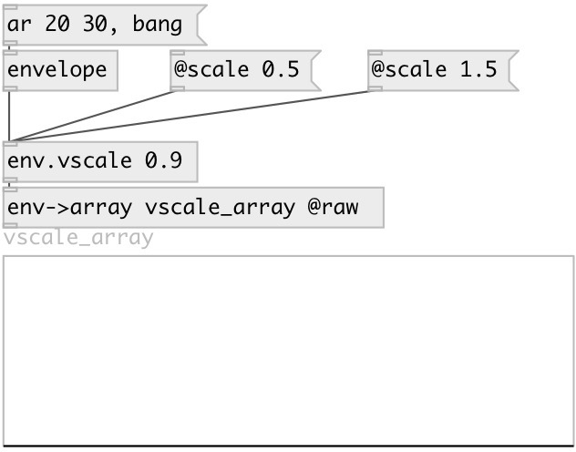

[index](index.html) :: [env](category_env.html)
---

# env.vscale

###### Envelope value-scale

*доступно с версии:* 0.5

---

## аргументы:

* **SCALE**
value-scale 
_тип:_ float 

## свойства:

* **@scale** 
Запросить/установить value-scale 
_тип:_ float 
_по умолчанию:_ 1 

## входы:

* input envelope 
_тип:_ control

## выходы:

* scaled output envelope 
_тип:_ control

## ключевые слова:

[value](keywords/value.html)
[scale](keywords/scale.html)

**Смотрите также:**
[\[env.tscale\]](env.tscale.html)
[\[envelope\]](envelope.html)

**Авторы:** Serge Poltavsky

**Лицензия:** GPL3 or later

