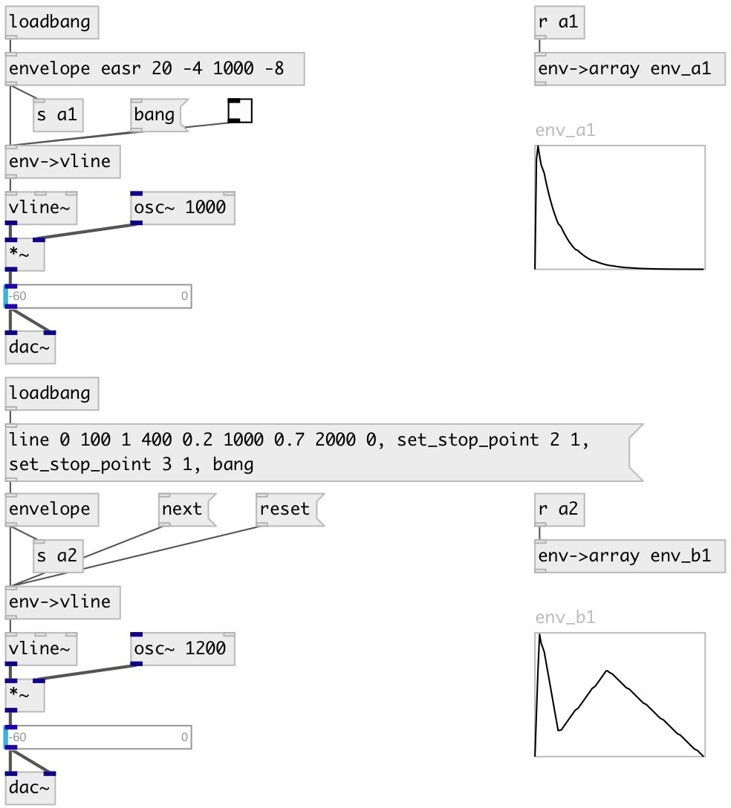

[index](index.html) :: [env](category_env.html)
---

# env2vline

###### Converts envelope to bunch of vline messages

*доступно с версии:* 0.5

---

## информация
Supports stop-points for multisegment envelopes. Note: non-linear envelopes are outputted using linear approximation

## методы:

* **next**
output segment until next stop-point or end of envelope is reached 

* **reset**
reset current segment position for multi-segment envelopes 

## свойства:

* **@sync** 
Получить/установить sync with input data. When set to 1 outputs envelope (as fixed) on every input
data 
_тип:_ int 
_варианты:_ 0, 1 
_по умолчанию:_ 0 

## входы:

* output as envelope of fixed length (no stop-points are encountered) 
_тип:_ control

## выходы:

* bunch of vline-compatible messages: VALUE, DURATION, OFFSET 
_тип:_ control

## ключевые слова:

[envelope](keywords/envelope.html)
[vline](keywords/vline.html)

**Смотрите также:**
[\[vline-&gt;env\]](vline-%3Eenv.html)
[\[env-&gt;array\]](env-%3Earray.html)

**Авторы:** Serge Poltavsky

**Лицензия:** GPL3 or later

