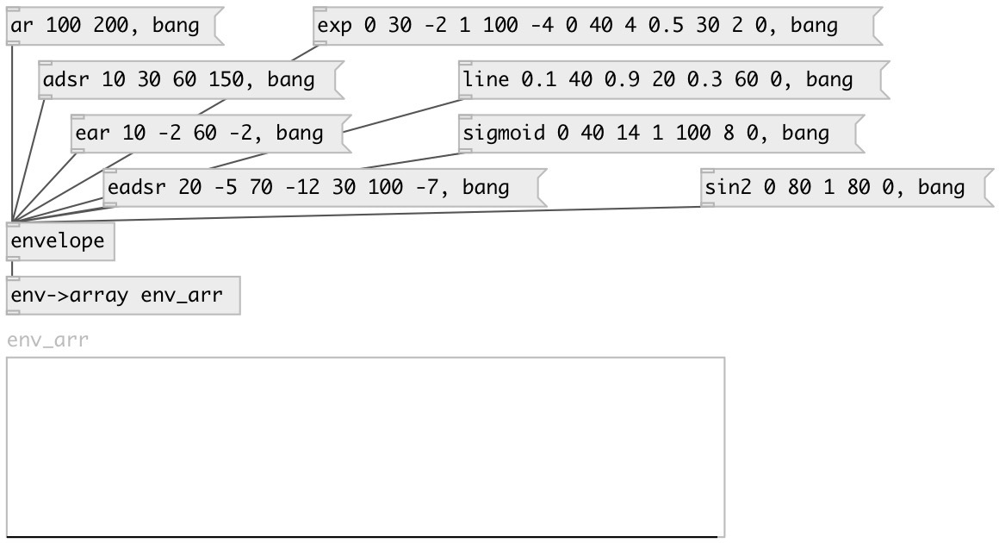

[index](index.html) :: [env](category_env.html)
---

# envelope

###### Envelope data type

*доступно с версии:* 0.5

---

## информация
Data type for sound envelope. Contains points specified by time and value. Points could have stop property - to execute oly part of envelope and stop on this point. So multisegment envelopes could be created Point also has segment type property, that defines following segment curve - it could be *step*, *line* (default) or *exp* (exponential) Exponential segment also has curve property: if 0 - (linear) 0 (convex, positively curved)

## аргументы:

* **adsr**
ADSR envelope: attack(ms), decay(ms), sustain(%), release(ms) 
_тип:_ list 

* **asr**
ASR envelope: attack(ms), release(ms) - with sustain stop point 
_тип:_ list 

* **ar**
AR envelope: attack(ms), release(ms) 
_тип:_ list 

* **eadsr**
exponential ADSR envelope: attack(ms), attack_curve, decay(ms), decay_curve,
sustain(%), release(ms), release_curve 
_тип:_ list 

* **easr**
exponential ASR envelope: attack(ms), attack_curve, release(ms), release_curve
- with sustain stop point 
_тип:_ list 

* **ear**
exponential ASR envelope: attack(ms), attack_curve, release(ms), release_curve
- no sustain point 
_тип:_ list 

## методы:

* **clear**
remove all envelope points 

* **add_point**
add envelope point 
  __параметры:__
  - **TIME** point time 
    тип: float  
    единица: ms  
    обязательно: True  

  - **VALUE** point value 
    тип: float  
    обязательно: True  

  - **[IS_STOP=0]** is stop point 
    тип: int  

  - **[TYPE=line]** segment type: step, linear, exponential, sin^2 or sigmoid curve 
    тип: symbol  

  - **[CURVE=1]** exponential curve degree: 0 (linear) 0 (convex, positively curved) 
    тип: float  

* **remove_point**
remove envelope point by specified time 
  __параметры:__
  - **IDX** point index 
    тип: int  
    обязательно: True  

* **set_point**
set point time and value 
  __параметры:__
  - **IDX** point index 
    тип: int  
    обязательно: True  

  - **TIME** point time 
    тип: float  
    единица: ms  
    обязательно: True  

  - **VALUE** point value 
    тип: int  
    обязательно: True  

  - **[IS_STOP=0]** stop point 
    тип: int  

* **set_point_time**
set point time 
  __параметры:__
  - **IDX** point index 
    тип: int  
    обязательно: True  

  - **TIME** point time 
    тип: float  
    единица: ms  
    обязательно: True  

* **set_point_value**
set point time 
  __параметры:__
  - **IDX** point index 
    тип: int  
    обязательно: True  

  - **VALUE** point value 
    тип: int  
    обязательно: True  

* **set_stop_point**
set stop-point 
  __параметры:__
  - **IDX** point index 
    тип: int  
    обязательно: True  

  - **IS_STOP** stop point 
    тип: int  
    обязательно: True  

* **+**
add specified value to all envelope points 
  __параметры:__
  - **VALUE** value 
    тип: float  
    обязательно: True  

* *****
multiply all envelope points to specified value 
  __параметры:__
  - **VALUE** value 
    тип: float  
    обязательно: True  

* **&gt;&gt;**
shift all envelope point by specified time in milliseconds 
  __параметры:__
  - **SHIFT** value 
    тип: float  
    единица: ms  
    обязательно: True  

* **add_seg**
add segment to the end of envelope. On empty envelope adds start point at 0ms
and 0 value 
  __параметры:__
  - **TYPE** segment type 
    тип: symbol  
    обязательно: True  

  - **LENGTH** segment length 
    тип: float  
    единица: ms  
    обязательно: True  

  - **VALUE** end segment value 
    тип: float  
    обязательно: True  

  - **[CURVE=0]** curve (for exp and sigmoid type) 
    тип: float  

* **set_seg_type**
set segment type 
  __параметры:__
  - **IDX** segment index, starting from 0 
    тип: int  
    обязательно: True  

  - **TYPE** segment type 
    тип: symbol  
    обязательно: True  

* **adsr**
creates ADSR envelope with one stop point 
  __параметры:__
  - **ATTACK** attack time 
    тип: float  
    единица: ms  
    обязательно: True  

  - **DECAY** decay time 
    тип: float  
    единица: ms  
    обязательно: True  

  - **SUSTAIN** sustain level 
    тип: float  
    единица: %  
    обязательно: True  

  - **RELEASE** release time 
    тип: float  
    единица: ms  
    обязательно: True  

* **asr**
creates ASR envelope with one stop point 
  __параметры:__
  - **ATTACK** attack time 
    тип: float  
    единица: ms  
    обязательно: True  

  - **RELEASE** release time 
    тип: float  
    единица: ms  
    обязательно: True  

* **ar**
creates AR envelope without stop points 
  __параметры:__
  - **ATTACK** attack time 
    тип: float  
    единица: ms  
    обязательно: True  

  - **RELEASE** release time 
    тип: float  
    единица: ms  
    обязательно: True  

* **eadsr**
creates exponential ADSR envelope with one stop point 
  __параметры:__
  - **ATTACK** attack time 
    тип: float  
    единица: ms  
    обязательно: True  

  - **ATTACK_CURVE** attack segment curve 
    тип: float  
    обязательно: True  

  - **DECAY** decay time 
    тип: float  
    единица: ms  
    обязательно: True  

  - **DECAY_CURVE** decay segment curve 
    тип: float  
    обязательно: True  

  - **SUSTAIN** sustain level 
    тип: float  
    единица: %  
    обязательно: True  

  - **RELEASE** release time 
    тип: float  
    единица: ms  
    обязательно: True  

  - **RELEASE_CURVE** release segment curve 
    тип: float  
    обязательно: True  

* **easr**
creates exponential AR envelope with one stop point 
  __параметры:__
  - **ATTACK** attack time 
    тип: float  
    единица: ms  
    обязательно: True  

  - **ATTACK_CURVE** attack segment curve 
    тип: float  
    обязательно: True  

  - **RELEASE** release time 
    тип: float  
    единица: ms  
    обязательно: True  

  - **RELEASE_CURVE** release segment curve 
    тип: float  
    обязательно: True  

* **ear**
creates exponential AR envelope without stop points 
  __параметры:__
  - **ATTACK** attack time 
    тип: float  
    единица: ms  
    обязательно: True  

  - **ATTACK_CURVE** attack segment curve 
    тип: float  
    обязательно: True  

  - **RELEASE** release time 
    тип: float  
    единица: ms  
    обязательно: True  

  - **RELEASE_CURVE** release segment curve 
    тип: float  
    обязательно: True  

* **step**
creates step-segmented envelope with arbitrary number of segments 
  __параметры:__
  - **VAL0** begin value 
    тип: float  
    обязательно: True  

  - **LEN0** step length 
    тип: float  
    единица: ms  
    обязательно: True  

  - **VAL1** value 
    тип: float  
    обязательно: True  

  - **[LEN1]** segment length 
    тип: float  

  - **[VAL2]** value 
    тип: float  

* **line**
creates line-segmented envelope with arbitrary number of segments 
  __параметры:__
  - **VAL0** begin value 
    тип: float  
    обязательно: True  

  - **LEN0** line length 
    тип: float  
    единица: ms  
    обязательно: True  

  - **VAL1** value 
    тип: float  
    обязательно: True  

  - **[LEN1]** segment length 
    тип: float  

  - **[VAL2]** value 
    тип: float  

* **sin2**
creates quadratic sine-segmented envelope with arbitrary number of segments 
  __параметры:__
  - **VAL0** begin value 
    тип: float  
    обязательно: True  

  - **LEN0** line length 
    тип: float  
    единица: ms  
    обязательно: True  

  - **VAL1** value 
    тип: float  
    обязательно: True  

  - **[LEN1]** segment length 
    тип: float  

  - **[VAL2]** value 
    тип: float  

* **exp**
creates exponential-segmented envelope with arbitrary number of segments 
  __параметры:__
  - **VAL0** begin value 
    тип: float  
    обязательно: True  

  - **LEN0** line length 
    тип: float  
    единица: ms  
    обязательно: True  

  - **CURVE0** segment curve 
    тип: float  
    обязательно: True  

  - **VAL1** value 
    тип: float  
    обязательно: True  

  - **[LEN1]** segment length 
    тип: float  

  - **[CURVE1]** segment curve 
    тип: float  

  - **[VAL2]** value 
    тип: float  

* **sigmoid**
creates sigmoid-segmented envelope with arbitrary number of segments 
  __параметры:__
  - **VAL0** begin value 
    тип: float  
    обязательно: True  

  - **LEN0** line length 
    тип: float  
    единица: ms  
    обязательно: True  

  - **CURVE0** segment curve 
    тип: float  
    обязательно: True  

  - **VAL1** value 
    тип: float  
    обязательно: True  

  - **[LEN1]** segment length 
    тип: float  

  - **[CURVE1]** segment curve 
    тип: float  

  - **[VAL2]** value 
    тип: float  

## свойства:

* **@npoints** (readonly)
Получить number of points 
_тип:_ int 
_минимальное значение:_ 0 
_по умолчанию:_ 0 

* **@length** (readonly)
Получить total envelope time length 
_тип:_ float 
_единица:_ ms 
_минимальное значение:_ 0 
_по умолчанию:_ 0 

* **@points** (readonly)
Получить list of point times (ms) 
_тип:_ list 

* **@values** (readonly)
Получить list of point values 
_тип:_ list 

* **@stops** (readonly)
Получить list of stop points 
_тип:_ list 

## входы:

* outputs current envelope 
_тип:_ control

## выходы:

* data output 
_тип:_ control

## ключевые слова:

[envelope](keywords/envelope.html)

**Смотрите также:**
[\[env-&gt;array\]](env-%3Earray.html)
[\[env-&gt;vline\]](env-%3Evline.html)

**Авторы:** Serge Poltavsky

**Лицензия:** GPL3 or later

