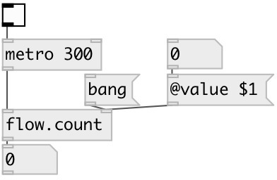

[index](index.html) :: [flow](category_flow.html)
---

# flow.count

###### control flow event counter

*доступно с версии:* 0.4

---

## аргументы:

* **VALUE**
counter init value 
_тип:_ int 

## свойства:

* **@value** 
Запросить/установить current counter state. Can be set via message to second(!) inlet or [prop.set]
object. 
_тип:_ int 
_минимальное значение:_ 0 
_по умолчанию:_ 0 

## входы:

* input messages 
_тип:_ control
* reset counter to init value (no output) 
_тип:_ control

## выходы:

* outputs event number 
_тип:_ control

## ключевые слова:

[counter](keywords/counter.html)

**Авторы:** Serge Poltavsky

**Лицензия:** GPL3 or later

