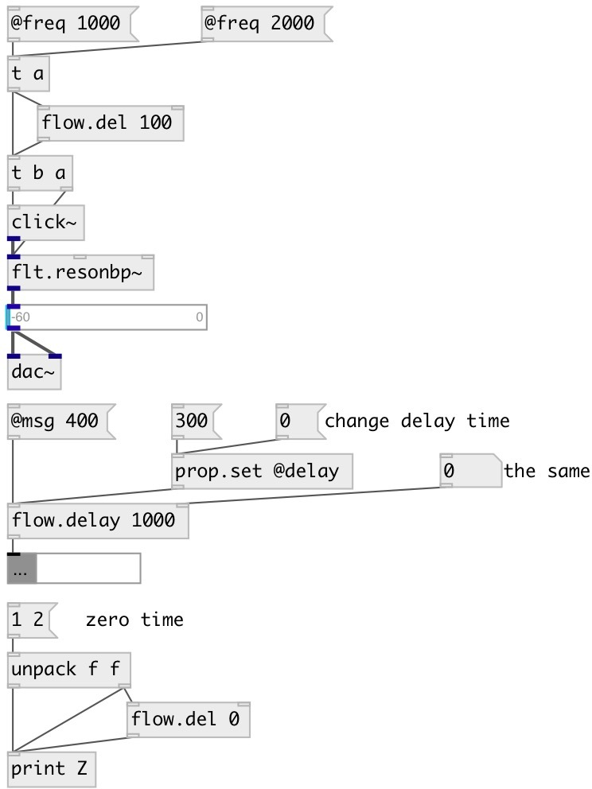

[index](index.html) :: [flow](category_flow.html)
---

# flow.delay

###### enhanced version on vanilla delay object

*доступно с версии:* 0.9.1

---

## информация
Delay any incoming message by specified time. If @block=0 acts like vanilla [delay] if new message has arrived while delay time is not expired, old message is discarded and new delay time is set from current moment. Zero delay time means output message on next Pd runloop iteration (as soon as possible) Note: @delay property can be set only via right inlet or [prop.set] object

## аргументы:

* **MS**
init @delay property 
_тип:_ float 
_единица:_ ms 

## свойства:

* **@delay** 
Получить/установить delay time 
_тип:_ float 
_единица:_ ms 
_минимальное значение:_ 0 
_по умолчанию:_ 0 

* **@block** 
Получить/установить blocking mode. If true, discards incoming messages until scheduled message will
output, after that is ready to accept the new one. Otherwise acts like vanilla
[del] object. 
_тип:_ int 
_варианты:_ 0, 1 
_по умолчанию:_ 0 

## входы:

* incoming message 
_тип:_ control
* reset (stop) current delay 
_тип:_ control

## выходы:

* outputs nothing. connect to destination object(s) 
_тип:_ control

## ключевые слова:

[flow](keywords/flow.html)
[delay](keywords/delay.html)

**Смотрите также:**
[\[delay\]](delay.html)

**Авторы:** Serge Poltavsky

**Лицензия:** GPL3 or later

