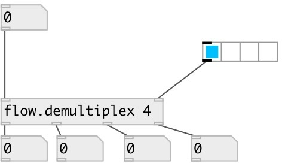

[index](index.html) :: [flow](category_flow.html)
---

# flow.demultiplex

###### control flow demultiplexer

*доступно с версии:* 0.6

---

## информация
Note: you can get/set object properties only via prop.set/prop.get objects

## аргументы:

* **N**
number of outlets 
_тип:_ int 

## свойства:

* **@index** 
Запросить/установить current demultiplexer output index 
_тип:_ int 
_минимальное значение:_ 0 
_по умолчанию:_ 0 

* **@n** (initonly)
Запросить/установить number of outlets 
_тип:_ int 
_диапазон:_ 2..24 
_по умолчанию:_ 2 

## входы:

* input flow inlet 
_тип:_ control
* output selector 
_тип:_ control

## выходы:

* demultiplexer first output 
_тип:_ control
* demultiplexer N-th output 
_тип:_ control

## ключевые слова:

[demultiplex](keywords/demultiplex.html)

**Смотрите также:**
[\[flow.multiplex\]](flow.multiplex.html)

**Авторы:** Serge Poltavsky

**Лицензия:** GPL3 or later

