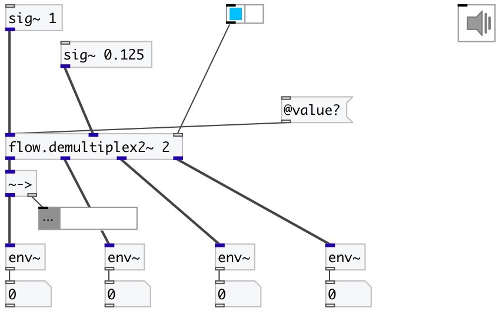

[index](index.html) :: [flow](category_flow.html)
---

# flow.demultiplex2~

###### audio stream stereo demultiplexer

*доступно с версии:* 0.6

---

## аргументы:

* **N**
number of output stereo-pairs 
_тип:_ int 

## свойства:

* **@value** 
Запросить/установить gain coefficients per each output 
_тип:_ list 

* **@n** (initonly)
Запросить/установить number of output stereo channels 
_тип:_ int 
_диапазон:_ 2..16 
_по умолчанию:_ 2 

## входы:

* left input signal 
_тип:_ audio
* right input signal 
_тип:_ audio
* demultiplexer control 
_тип:_ control

## выходы:

* first left output 
_тип:_ audio
* first right output 
_тип:_ audio
* ... left output 
_тип:_ audio
* ... right output 
_тип:_ audio
* last left output 
_тип:_ audio
* last right output 
_тип:_ audio

## ключевые слова:

[flow](keywords/flow.html)
[demultiplex](keywords/demultiplex.html)

**Смотрите также:**
[\[flow.demultiplex~\]](flow.demultiplex~.html)
[\[flow.demultiplex\]](flow.demultiplex.html)

**Авторы:** Serge Poltavsky

**Лицензия:** GPL3 or later

