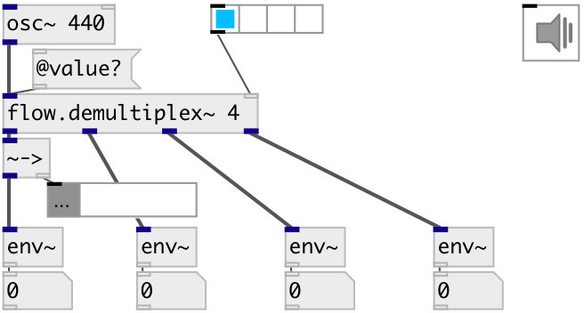

[index](index.html) :: [flow](category_flow.html)
---

# flow.demultiplex~

###### audio stream demultiplexer

*доступно с версии:* 0.6

---

## аргументы:

* **N**
number of signals outputs 
_тип:_ int 

## свойства:

* **@value** 
Получить/установить gain coefficients per each output 
_тип:_ list 
_по умолчанию:_ 1 0 

## входы:

* input signal 
_тип:_ audio
* demultiplexer control 
_тип:_ control

## выходы:

* first output 
_тип:_ audio
* ... output 
_тип:_ audio
* n-th output 
_тип:_ audio

## ключевые слова:

[flow](keywords/flow.html)
[demultiplex](keywords/demultiplex.html)

**Смотрите также:**
[\[flow.demultiplex2~\]](flow.demultiplex2~.html)
[\[flow.demultiplex\]](flow.demultiplex.html)

**Авторы:** Serge Poltavsky

**Лицензия:** GPL3 or later

