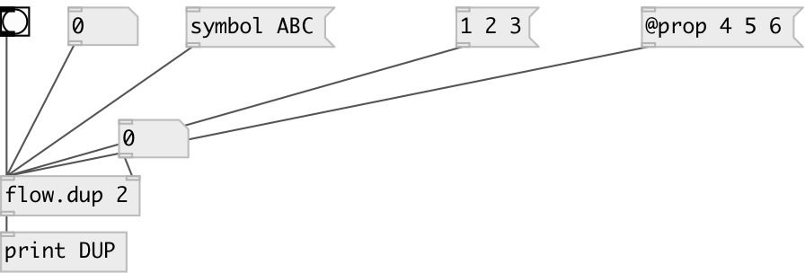

[index](index.html) :: [flow](category_flow.html)
---

# flow.dup

###### message duplicator

*доступно с версии:* 0.9.1

---

## информация
Output incoming message specified number of times

## аргументы:

* **N**
number of repeats 
_тип:_ int 

## свойства:

* **@n** 
Запросить/установить number of repeats 
_тип:_ int 
_минимальное значение:_ 0 
_по умолчанию:_ 2 

## входы:

* incoming message 
_тип:_ control
* set number of repeats 
_тип:_ control

## выходы:

* output 
_тип:_ control

## ключевые слова:

[flow](keywords/flow.html)
[duplicate](keywords/duplicate.html)
[repeat](keywords/repeat.html)

**Смотрите также:**
[\[flow.mem\]](flow.mem.html)

**Авторы:** Serge Poltavsky

**Лицензия:** GPL3 or later

