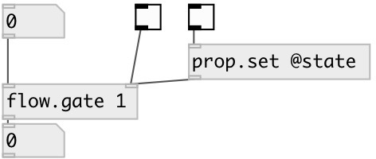

[index](index.html) :: [flow](category_flow.html)
---

# flow.gate

###### control flow gate. [spigot] analog

*доступно с версии:* 0.4

---

## информация
Note: property setting can be done only via [prop.set] object, since object accepts all incoming messages

## аргументы:

* **PASS**
init gate state. 1 means open, 0 - closed. By default gate is closed 
_тип:_ int 

## свойства:

* **@state** 
Получить/установить gate state. 1 means open, 0 - closed 
_тип:_ int 
_варианты:_ 0, 1 
_по умолчанию:_ 0 

## входы:

* input flow 
_тип:_ control
* gate control inlet. Sending *1* opens gate, *0* - closes 
_тип:_ control

## выходы:

* output flow 
_тип:_ control

## ключевые слова:

[gate](keywords/gate.html)

**Смотрите также:**
[\[flow.pass\]](flow.pass.html)

**Авторы:** Serge Poltavsky

**Лицензия:** GPL3 or later

