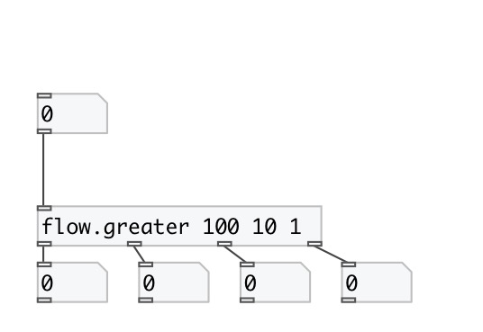

[index](index.html) :: [flow](category_flow.html)
---

# flow.greater

###### numeric stream router

*доступно с версии:* 0.9.1

---

## информация
Numbers thar are *less* or *equal* then last argument are passed to N-th inlet

## аргументы:

* **VALUES**
compare values: list of floats in descending order 
_тип:_ list 

## свойства:

* **@values** (initonly)
Запросить/установить compare values: list of floats in descending order 
_тип:_ list 

## входы:

* input flow 
_тип:_ control

## выходы:

* numbers that are greater then 1st argument 
_тип:_ control
* numbers that are greater than ... argument 
_тип:_ control
* numbers that are greater than last argument 
_тип:_ control
* numbers that are less or equal than last argument 
_тип:_ control

## ключевые слова:

[gate](keywords/gate.html)
[greater](keywords/greater.html)

**Смотрите также:**
[\[flow.less\]](flow.less.html)

**Авторы:** Serge Poltavsky

**Лицензия:** GPL3 or later

