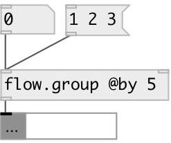

[index](index.html) :: [flow](category_flow.html)
---

# flow.group

###### group input atoms in list of specified size

*доступно с версии:* 0.3

---

## аргументы:

* **SIZE**
group by this size 
_тип:_ int 

## методы:

* **flush**
outputs and clears group 

* **clear**
clear without output 

## свойства:

* **@by** 
Получить/установить group size 
_тип:_ int 
_минимальное значение:_ 1 
_по умолчанию:_ 1 

* **@free** (readonly)
Получить free space left in group 
_тип:_ int 
_минимальное значение:_ 0 
_по умолчанию:_ 0 

## входы:

* add float to group and flush if group is full packed 
_тип:_ control
* set group size 
_тип:_ control

## выходы:

* output list of grouped atoms 
_тип:_ control

## ключевые слова:

[flow](keywords/flow.html)
[group](keywords/group.html)

**Авторы:** Serge Poltavsky

**Лицензия:** GPL3 or later

