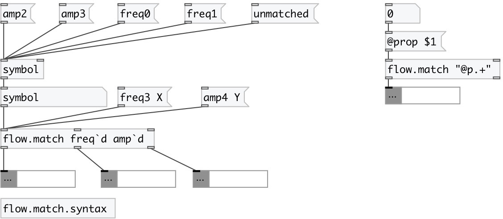

[index](index.html) :: [flow](category_flow.html)
---

# flow.match

###### route data flow by regexp match

*доступно с версии:* 0.7.1

---

## информация
Use backtick ` instead of backslash in regexp syntax if you want to match property - use double quotes in arg list: &#34;@prop+&#34;

## аргументы:

* **PATTERNS**
list of regular expressions 
_тип:_ list 

## свойства:

* **@patterns** (initonly)
Запросить/установить list of regular expressions 
_тип:_ list 

* **@cut** 
Запросить/установить cut or pass message selector 
_тип:_ bool 
_по умолчанию:_ 0 

## входы:

* input message 
_тип:_ control
* set first regexp 
_тип:_ control
* set ... regexp 
_тип:_ control
* set n-th regexp 
_тип:_ control

## выходы:

* output match to first regexp 
_тип:_ control
* output match to ... regexp 
_тип:_ control
* output match to n-th regexp 
_тип:_ control
* unmatched output 
_тип:_ control

## ключевые слова:

[regexp](keywords/regexp.html)

**Смотрите также:**
[\[string.match\]](string.match.html)

**Авторы:** Serge Poltavsky

**Лицензия:** GPL3 or later

