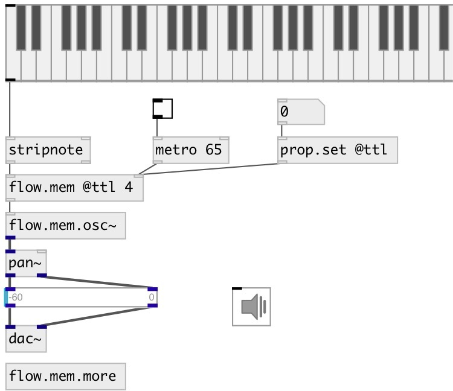

[index](index.html) :: [flow](category_flow.html)
---

# flow.mem

###### store data flow in memory

*доступно с версии:* 0.9.1

---

## аргументы:

* **N**
number of memory cells 
_тип:_ int 

## свойства:

* **@n** 
Получить/установить number of memory cells 
_тип:_ int 
_диапазон:_ 1..32 
_по умолчанию:_ 1 

* **@free** 
Получить/установить clear cell mode. If on - clear cell counter after zero was reached. 
_тип:_ int 
_варианты:_ 0, 1 
_по умолчанию:_ 1 

* **@ttl** 
Получить/установить time to live counter. Each time you set new value its memory cell counter is
set to this. Each time memory cell is outputted individual memory cell ttl
counter (not this property!) is decremented until zero reached. After that if
@free property is on memory cell is cleared. If this property equals zero
memory cell never expires. 
_тип:_ int 
_диапазон:_ 0..1024 
_по умолчанию:_ 0 

## входы:

* input: store in 1st memory cell 
_тип:_ control
* input: store in ... memory cell 
_тип:_ control
* input: store in n-th memory cell 
_тип:_ control
* output all cells 
_тип:_ control

## выходы:

* output 1st cell 
_тип:_ control
* output ... cell 
_тип:_ control
* output n-th cell 
_тип:_ control

## ключевые слова:

[memory](keywords/memory.html)
[store](keywords/store.html)

**Авторы:** Serge Poltavsky

**Лицензия:** GPL3 or later

