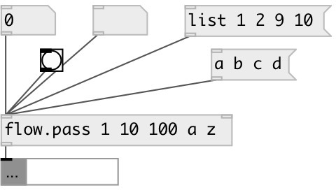

[index](index.html) :: [flow](category_flow.html)
---

# flow.pass

###### pass specified values

*доступно с версии:* 0.3

---

## аргументы:

* **VALUES**
atoms to pass 
_тип:_ list 

## свойства:

* **@values** 
Запросить/установить atoms to pass 
_тип:_ list 

## входы:

* pass 
_тип:_ control
* set pass list 
_тип:_ control

## выходы:

* passed values 
_тип:_ control

## ключевые слова:

[pass](keywords/pass.html)
[functional](keywords/functional.html)

**Смотрите также:**
[\[flow.pass_if\]](flow.pass_if.html)
[\[flow.reject\]](flow.reject.html)

**Авторы:** Serge Poltavsky

**Лицензия:** GPL3 or later

