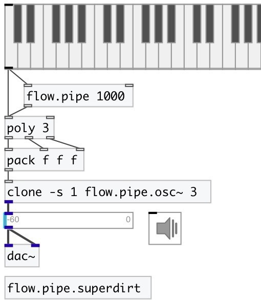

[index](index.html) :: [flow](category_flow.html)
---

# flow.pipe

###### enhanced version on vanilla pipe object

*доступно с версии:* 0.9.1

---

## информация
Acts like vanilla [pipe] but for any messages: bangs, floats, symbols etc. Note: @delay property can be set only via right inlet or [prop.set] object

## аргументы:

* **DELAY**
init @delay property 
_тип:_ float 
_единица:_ ms 

## свойства:

* **@delay** 
Запросить/установить delay time 
_тип:_ float 
_единица:_ ms 
_минимальное значение:_ 0 
_по умолчанию:_ 0 

* **@empty** (readonly)
Запросить 1 if pipe is empty, otherwise 0. 
_тип:_ bool 
_по умолчанию:_ 1 

* **@size** (readonly)
Запросить pipe size 
_тип:_ int 
_по умолчанию:_ 0 

## входы:

* incoming message 
_тип:_ control
* clear pipe 
_тип:_ control

## выходы:

* pipe output 
_тип:_ control

## ключевые слова:

[flow](keywords/flow.html)
[pipe](keywords/pipe.html)

**Смотрите также:**
[\[flow.delay\]](flow.delay.html)

**Авторы:** Serge Poltavsky

**Лицензия:** GPL3 or later

