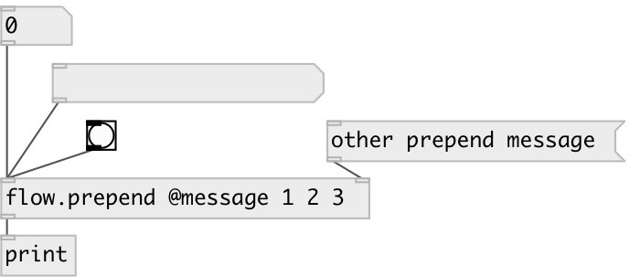

[index](index.html) :: [flow](category_flow.html)
---

# flow.prepend

###### prepend message before received one

*доступно с версии:* 0.9.7

---

## аргументы:

* **MSG**
init value for prepended message 
_тип:_ list 

## свойства:

* **@msg** 
Запросить/установить prepended message 
_тип:_ list 

## входы:

* input message 
_тип:_ control
* set prepend value 
_тип:_ control

## выходы:

* output message 
_тип:_ control

## ключевые слова:

[flow](keywords/flow.html)
[prepend](keywords/prepend.html)

**Смотрите также:**
[\[flow.append\]](flow.append.html)

**Авторы:** Serge Poltavsky

**Лицензия:** GPL3 or later

