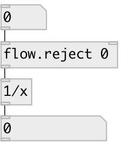

[index](index.html) :: [flow](category_flow.html)
---

# flow.reject

###### reject specified values

*доступно с версии:* 0.3

---

## аргументы:

* **VALUES**
list of atoms to reject 
_тип:_ list 

## свойства:

* **@values** 
Запросить/установить atoms to reject 
_тип:_ list 

## входы:

* pass 
_тип:_ control
* set reject list 
_тип:_ control

## выходы:

* passed values 
_тип:_ control

## ключевые слова:

[reject](keywords/reject.html)
[functional](keywords/functional.html)

**Смотрите также:**
[\[flow.reject_if\]](flow.reject_if.html)
[\[flow.pass\]](flow.pass.html)

**Авторы:** Serge Poltavsky

**Лицензия:** GPL3 or later

