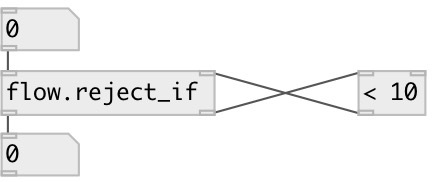

[index](index.html) :: [flow](category_flow.html)
---

# flow.reject_if

###### reject values by predicate

*доступно с версии:* 0.3

---

## информация
conditional value reject according to *predicate* object. *predicate* should accept value and ouput 0 or 1, for value passing. [&lt;] [is_even] [is_list] - examples of predicates.

## входы:

* input value 
_тип:_ control
* value from predicate (0 or 1). If *1* reject value, if *0* - pass. 
_тип:_ control

## выходы:

* passed values 
_тип:_ control
* output value to predicate 
_тип:_ control

## ключевые слова:

[reject](keywords/reject.html)
[functional](keywords/functional.html)

**Смотрите также:**
[\[flow.pass_if\]](flow.pass_if.html)
[\[flow.reject\]](flow.reject.html)
[\[is_even\]](is_even.html)

**Авторы:** Serge Poltavsky

**Лицензия:** GPL3 or later

