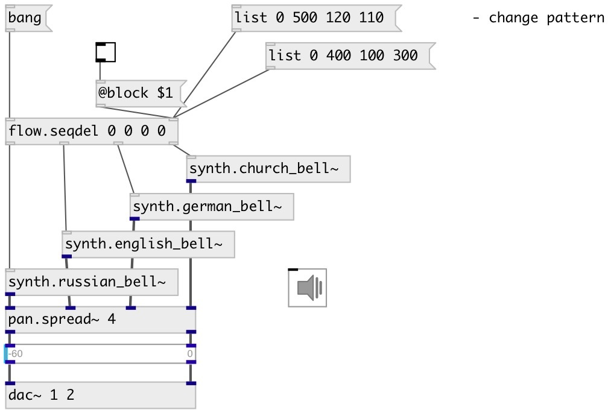

[index](index.html) :: [flow](category_flow.html)
---

# flow.seqdelay

###### sequential delay/router for input flow

*доступно с версии:* 0.9.5

---

## информация
Delay any route incoming message by specified relative time list. If @block=0 if new message has arrived while delay time is not expired, old message is discarded and new delay time is set from current moment. Zero delay time means output message on next Pd runloop iteration (as soon as possible) Note: @t and @block property can be set only via right inlet or with [prop.set] object

## аргументы:

* **T**
List of delay times. See @t property. 
_тип:_ list 
_единица:_ ms 

## методы:

* **reset**
reset all scheduled delays 

## свойства:

* **@t** 
Запросить/установить delay time list 
_тип:_ list 
_единица:_ ms 
_минимальное значение:_ 0 

* **@block** 
Запросить/установить blocking mode. If true, discards incoming messages until scheduled message will
output, after that is ready to accept the new one. 
_тип:_ bool 
_по умолчанию:_ 0 

## входы:

* incoming message 
_тип:_ control
* set delay times 
_тип:_ control

## выходы:

* first delayed output 
_тип:_ control
* ...-th delayed output 
_тип:_ control
* n-th delayed output 
_тип:_ control

## ключевые слова:

[flow](keywords/flow.html)
[seq](keywords/seq.html)
[delay](keywords/delay.html)

**Смотрите также:**
[\[flow.delay\]](flow.delay.html)

**Авторы:** Serge Poltavsky

**Лицензия:** GPL3 or later

