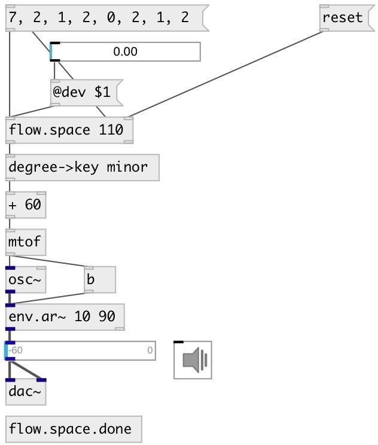

[index](index.html) :: [flow](category_flow.html)
---

# flow.space

###### space in time messages received at the same logical time

*доступно с версии:* 0.9.1

---

## информация
first message is delayed to next scheduler time

## аргументы:

* **DELAY**
time space between messages 
_тип:_ float 
_единица:_ ms 

* **DONE**
time space = N*space after last outputted message 
_тип:_ int 

## свойства:

* **@delay** 
Запросить/установить time-space between messages 
_тип:_ float 
_единица:_ ms 
_минимальное значение:_ 1 
_по умолчанию:_ 1 

* **@done** 
Запросить/установить time space (=@done*@delay) after last outputted message. After that delay
output bang to second outlet 
_тип:_ int 
_минимальное значение:_ 0 
_по умолчанию:_ 1 

* **@dev** 
Запросить/установить random deviation 
_тип:_ float 
_диапазон:_ 0..1 
_по умолчанию:_ 0 

## входы:

* messages 
_тип:_ control
* set space interval (ms) 
_тип:_ control

## выходы:

* output 
_тип:_ control
* bang on finish (after @delay*@done ms after last outputted message) 
_тип:_ control

## ключевые слова:

[space](keywords/space.html)

**Авторы:** Serge Poltavsky

**Лицензия:** GPL3 or later

