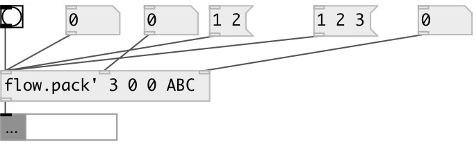

[index](index.html) :: [flow](category_flow.html)
---

# flow.sync_pack

###### flow pack with all hot inlets

*доступно с версии:* 0.8

---

## аргументы:

* **N**
number of inputs 
_тип:_ int 

* **INIT**
default values for all inlets. If not enough default values given it sets to 0 
_тип:_ list 

## свойства:

* **@n** (initonly)
Запросить/установить number of inlets 
_тип:_ int 
_диапазон:_ 1..255 
_по умолчанию:_ 1 

* **@init** (initonly)
Запросить/установить default init values 
_тип:_ list 

## входы:

* output current value 
_тип:_ control
* output current value 
_тип:_ control
* output current value and output 
_тип:_ control

## выходы:

* packed list or message (if message input) 
_тип:_ control

## ключевые слова:

[flow](keywords/flow.html)
[pack](keywords/pack.html)
[hot](keywords/hot.html)

**Смотрите также:**
[\[pack\]](pack.html)
[\[flow.pack\]](flow.pack.html)

**Авторы:** Serge Poltavsky

**Лицензия:** GPL3 or later

