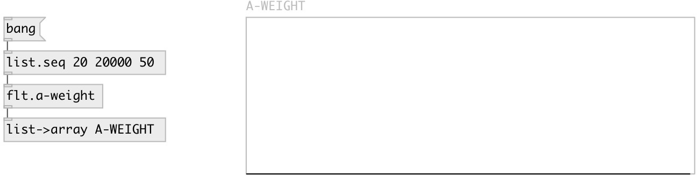

[index](index.html) :: [flt](category_flt.html)
---

# flt.a-weight

###### convert frequency to A-weight value

*доступно с версии:* 0.9.5

---

## свойства:

* **@db** (initonly)
Запросить/установить output in decibels 
_тип:_ flag 
_по умолчанию:_ 0 

## входы:

* input frequency in Herz 
_тип:_ control

## выходы:

* float or list A-weight amplitudes or decibel values 
_тип:_ control

## ключевые слова:

[filter](keywords/filter.html)
[weight](keywords/weight.html)
[A](keywords/A.html)

**Авторы:** Serge Poltavsky

**Лицензия:** GPL3 or later

